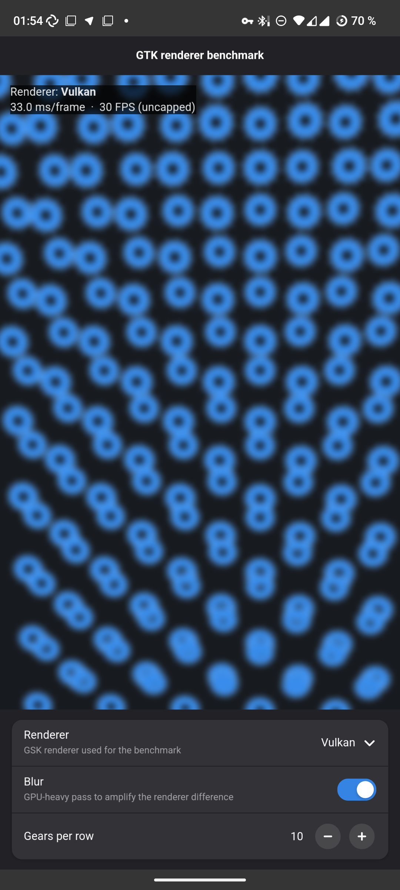

# GTK Vulkan / GL demo (incl. Android)

A small GTK4 / libadwaita app that makes the active GSK renderer visible and
comparable: it shows whether GTK is rendering through **Vulkan**, **OpenGL** or
**Cairo**, runs a GPU-stressing animated scene (a field of meshing, blurred
gears) with a live **ms/frame** counter, and lets you switch renderer at runtime.

It exists to demonstrate the **gdk-android Vulkan backend** - see
[Android](#android) - but it runs on any GTK 4 platform.

<p align="center"></p>

## What it shows

- **ms/frame, uncapped** - the scene is also rendered off-screen with
  `gsk_renderer_render_texture()` (which already waits for the GPU before it
  returns) purely to time it, so the reported `ms/frame` is the renderer's real
  cost, not the vsync-capped on-screen rate. The on-screen view is drawn live by
  the window's own renderer; nothing is read back or retained per frame.
- **Renderer** - a 3-way choice (`Vulkan` / `OpenGL` / `Cairo`). It is swapped
  **in place** (the off-screen benchmark renderer is realized against the surface
  and replaced live); there is no process relaunch, which matters on Android
  where the app cannot re-exec itself.
- **Blur** - a GPU-heavy pass that amplifies the difference between backends.
- **Gears per row** - density of the 3D scene (more gears = more load).

The scene is a perspective-projected 3D field of meshing gears (GSK 3D
transforms), so it stresses geometry + compositing, not just fill.

## Build & run (desktop)

```sh
meson setup build
meson compile -C build
./build/gtk-vulkan-demo
```

The in-app **Renderer** row switches the benchmarked renderer; to force the
*window* renderer too, use the env var:

```sh
GSK_RENDERER=vulkan ./build/gtk-vulkan-demo
GSK_RENDERER=gl     ./build/gtk-vulkan-demo
```

## Android

Upstream GTK ships **no Vulkan backend for `gdk-android`** (only a GL context),
so GTK always falls back to the GL renderer on Android. This demo carries the
patches (`packaging/android/gtk/`) that add one and make it actually render on
real phones:

- a `GdkAndroidVulkanContext` (`vkCreateAndroidSurfaceKHR` from the surface's
  `ANativeWindow`) + `VK_KHR_android_surface`,
- runtime resolution of the Vulkan 1.1 entry points (via
  `vkGet{Instance,Device}ProcAddr`) so the renderer links on `minSdk 26`,
- Vulkan as a *primary* renderer on Android (it was Wayland-only),
- **two gsk-gpu fixes** without which Vulkan crashes/leaks on mobile GPUs:
  the globals push-constant block (256 B) is moved to a dynamic UBO so it fits
  Adreno/Mali's `maxPushConstantsSize` of 128 (otherwise `vkCreateGraphicsPipelines`
  fails and the NULL pipeline crashes the driver), and a `GskTransform` leak in
  the 3D-transform path is fixed (it leaked one transform per 3D node per frame).

Built with these, the demo reports `Renderer: Vulkan` on API 28+ and falls back
to GL on API 26-27. Verified on a Samsung A73 (Adreno) and a Redmi / MediaTek
mt6768 (Mali), Android 8-14.

**Vulkan vs GL on mobile:** Vulkan renders correctly, but GL is still the faster
renderer on these GPUs (~13% on Adreno at equal scene, more on Mali), so GL stays
the better default on Android for now. The remaining gap is mobile Vulkan driver
maturity and the per-frame sync model, not these fixes.

The GTK-side patches also live as commits on the gdk-android branch they were
upstreamed from; see `packaging/android/gtk/` here for the exact set.

## License

LGPL-3.0-or-later.
